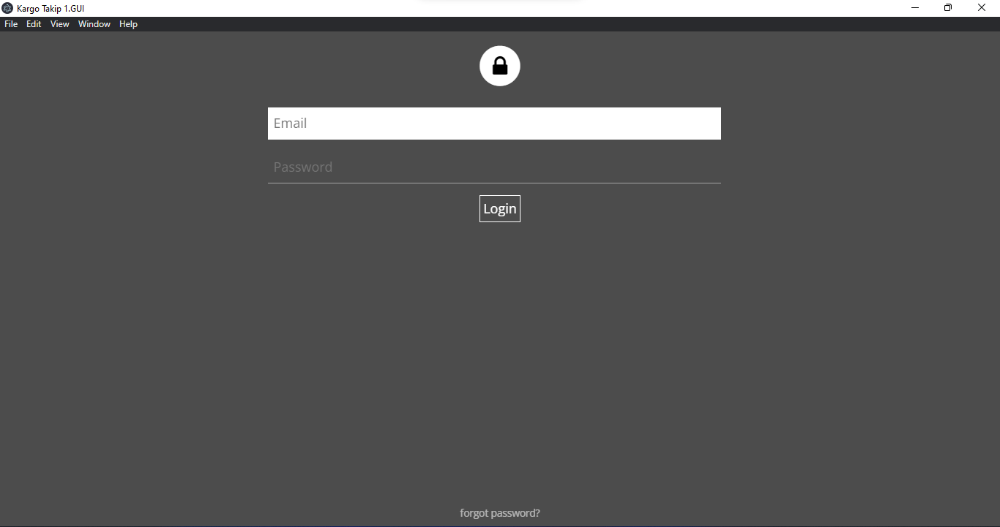
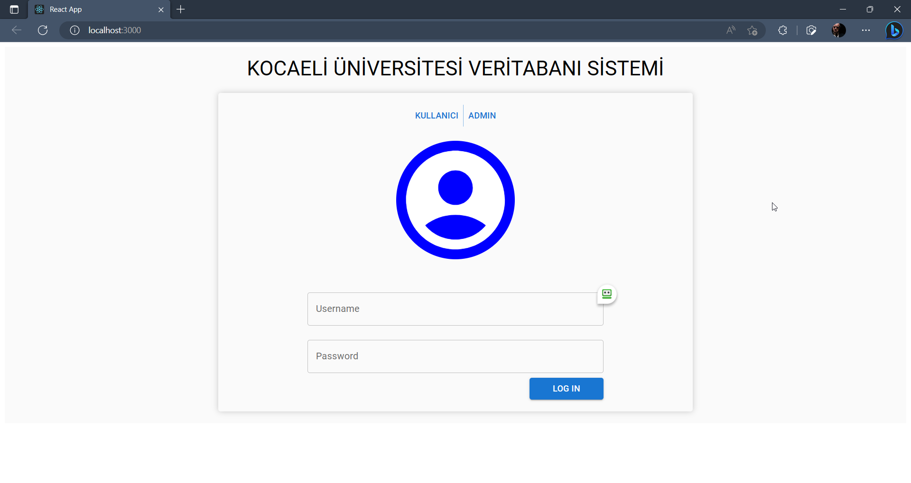

<h2>

Kocaeli Üniversitesi Programlama Labaratuvarı

</h2>

<h6>Aşağıdaki tüm projeler
<a href="https://github.com/yavuzkirikci">Yavuz Sefa Kırıkçı</a> ve 
<a href="https://github.com/muhammedzahit">Muhammet Zahit Aydın</a> tarafından hazırlanmıştır.</h6>

</h6>

<ol>
  <li>
  <a href = '#jafafx-card-game'>JavaFx Card Game</a>
  </li>
  <li>
  <a href = '#minimum-enclosing-circle'>C/C++ Minimum Enclosing Circle</a>
  </li>
  <li>
  <a href = '#text-word-counter'>C/C++ Text Word Counter</a>
  </li>
  <li>
  <a href = '#courier-management-system'>Courier Management System</a>
  </li>
  <li>
  <a href = '#samurai-sudoku-solver'>Samurai Sudoku Solver</a>
  </li>
  <li>
  <a href = '#pdf-upload-platform'>PDF Upload Platform</a>
  </li>
  <li>
  <a href = '#neo4j-akademik-yayın-platformu'>Neo4j Akademik Yayın Platformu</a>
  </li>
</ol>

## JavaFX Card Game

<h5> 
JavaFx kütüphanesi ile hazırlanmış bir kart oyunu projesi. Oyun içerisinde iki mod bulunmakta. İlk mod Futbolcu kartları için hazırlanmıştır. İkinci mod ise Basketbolcu kartları için hazırlanmıştır.Oyunun hangi modda olduğu arkaplan görseline bakarak karar verebilirsiniz. Oyun içerisinde oyuncuların kartları karşılaştırılarak kazanıp kaybetmeleri sağlanmıştır. Oyunun amacı oyuncuların kartlarını bitirmek ve rakibini yenmek. Oyunun sonunda kazanan oyuncu ekrana yazdırılmaktadır.
</h5>

<h5>
Oyun Görselleri:
</h5>

Görsel 1:

Görsel 2:

Görsel 3:

Görsel 4:

Görsel 5:

## Minimum Enclosing Circle

<h5>

C++ programlama dili kullanılarak verilen noktaların içerisine en küçük çemberi çizdiren program. Programın çalışma mantığı verilen noktaların içerisine en küçük çemberi çizmek için en küçük çemberin merkezini bulmak ve merkezden her noktaya olan uzaklığı bulmak. Bu uzaklıkların en büyüğü çemberin yarıçapı olacaktır. Programın çalışma mantığına ait görsel aşağıda verilmiştir.

B-Spline Spline interpolation kullanılarak bu noktalardan geçen eğri bulma problemi çözülmeye çalışılmıştır. Bu eğriye göre en küçük çemberin merkezini bulmak için Newton-Raphson yöntemi kullanılmıştır. Bu yöntemle bulunan merkez noktası ve yarıçapı kullanılarak en küçük çember çizdirilmiştir.

</h5>

Görsel 1:

Görsel 2:

Görsel 3:

Görsel 4:

## Text Word Counter

<h5>

Program, C programlama dili kullanarak metnin içerisinde hangi kelimenin kaç defa geçtiğini bulmayı amaçlar. Daha sonra bu kelimeleri ve sayısı çıktı.txt adlı dosyaya yazdırır. Kelimelerin tekrar sayılarına göre sıralanmış halini bellekte efektif bir şekilde yönetmek için Linked List yapılarını kullanır. 

</h5>

Görsel 1:

Görsel 2:

## Courier Management System

<h5>

Nodejs programlama dili kullanılarak bir kurye yönetim sistemi yapılmak amaçlanmıştır. Kullanıcı arayüz üzerinde istediği noktalara tıklayarak kuryenin gitmesi gereken yerleri işaretler ve 'Kargoyu Hareket Ettir' butonuna basar. 

Uygulama Google Maps API ile bağlantı kurar ve seçilen konumlar arasındaki mesafeleri ve gidilebilecek en kısa yolları çeker.

Daha sonra Djkstra algoritması kullanılarak en kısa yolu bulur ve bu yolu kullanarak kuryeyi hareket ettirir.

</h5>

Görsel 1:

Görsel 2:

Görsel 3:

Görsel 4:

Görsel 5:

## Samurai Sudoku Solver

<h5>

Java programlama dili kullanılarak samurai sudoku çözümleyici bir program yazılmıştır. Sudoku çözümleme problemi 9x9'luk bir sudoku çözümlemekten farklı olarak 9 adet 9x9'luk sudoku çözümlemekten oluşmaktadır. Bu 9 adet sudoku çözümlemesi için 'Divide and Conquer' yaklaşımı kullanılmıştır. Eğer bir hareket yapıldığında sudoku çözülemezse bu hareket geri alınır ve başka bir hareket denenir. Bu işlem sudoku çözülebilene kadar devam eder.

Program aynı zamanda 'Multithreading' konusunu da kapsamaktadır. Çözümleme işlemi için eğer thread sayısını arttırsak çözümleme süresi azalır mı? sorusuna cevap arar. Sonuç olarak thread sayımız belirli bir düzeye kadar arttırıldıkça çözümleme süresi azalmaktadır.

</h5>

Görsel 1:

Görsel 2:

Görsel 3:

## PDF Upload Platform

<h5>

Proje, kullanıcı ve admin panellirinin bulunduğu bir dosya
yükleme sistemi oluşturmayı amaçlamıştır.

Başlangıçta kullanıcıdan email ve şifre bilgilerine göre giriş
yapması istenir. Eğer kullanıcı bilgileri veritabanında bulunuyorsa
kullanıcı yetkinliğine göre panel sayfasına yönlendirilir. 

Admin yetkisine sahip kullanıcılar veritabanındaki kullanıcı giriş
bilgilerini güncelleyebilir. Aynı zamanda sisteme yüklenen pdf
dosyalarını belirli kriterlere göre sorgulayabilir.

User yetkisine sahip kullanıcılar veritabanında bulunan login
id’lerine göre sisteme pdf dosyası yükleyebilirler. Sorgu
bölümünde ise sadece kendi yükledikleri dosyalara erişebilirler. 

</h5>

Görsel 1:

Görsel 2:

Görsel 3:

Görsel 4:

Görsel 5:

Görsel 6:

Görsel 7:

## Neo4j Akademik Yayın Platformu

<h5>

Proje,Neo4j veritabanı kullanarak bir akademik yayın platformu oluşturmayı amaçlamıştır. Neo4j veritanı projeden bağımsız bir sunucuda çalışmaktadır. Proje gerekli authentication bilgilerini kullanarak bu sunucuya bağlanır ve veritabanı üzerinde işlemler yapar.

Server tarafında Nodejs kullanılmıştır. Client tarafında ise React kullanılmıştır. Server, Client'ın istediği Yayın Ekleme, Yayın Silme, Yayın Güncelleme, Yayın Listeleme, Yayın Sorgulama gibi işlemleri gerçekleştirir.

Client ise bu işlemleri gerçekleştirdikten sonra veritabanında yapılan değişiklikleri görebilmek için veritabanından verileri çeker ve ekrana basar.

</h5>

Görsel 1:

Görsel 2:

Görsel 3:

Görsel 4:

Görsel 5:

Görsel 6:

